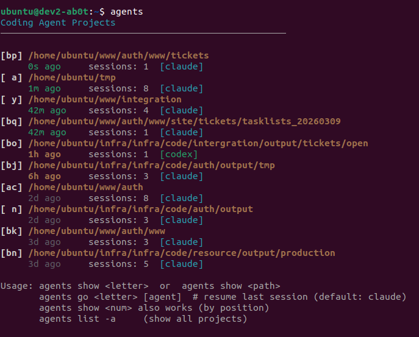

# agents

**Never lose track of where your AI agents are running.**

You're using Claude Code, Codex, Gemini — maybe all three — across dozens of projects. Sessions pile up. You forget where you left off. Resuming means hunting through directories and remembering session IDs.

`agents` fixes that. One command, and you see everything:

```
$ agents
Coding Agent Projects
────────────────────────────────────────────────────

[ a] /home/ubuntu/tmp
     20s ago    sessions: 8  [claude]
[bp] /home/ubuntu/www/auth/www/tickets
     30m ago    sessions: 1  [claude]
[ y] /home/ubuntu/www/integration
     31m ago    sessions: 4  [claude]
[bq] /home/ubuntu/www/auth/www/site/tickets/tasklists_20260309
     31m ago    sessions: 1  [claude]
[bo] /home/ubuntu/infra/infra/code/intergration/output/tickets/open
     1h ago     sessions: 1  [codex]
[bj] /home/ubuntu/infra/infra/code/auth/output/tmp
     6h ago     sessions: 3  [claude]
[ac] /home/ubuntu/www/auth
     2d ago     sessions: 8  [claude]

Usage: agents show <letter>  or  agents show <path>
       agents go <letter> [agent]  # resume last session
```

Every project. Every agent. Sorted by when you last touched it. Pick a letter and you're back in.

---

## What You Get

- **One view of all your agents** — Claude, Codex, Gemini sessions in a single list, sorted by recency
- **Instant resume** — `agents go a` drops you into the project directory and resumes your last session, no ID required
- **Session browser** — see what each conversation was about before you open it
- **Usage stats** — tokens, time, models, activity across all your agents
- **Tree view** — project structure annotated with session badges
- **Multi-agent aware** — tracks which agent (Claude, Codex, Gemini) owns each session

---

## Install

### One-liner

```bash
curl -sSL https://raw.githubusercontent.com/ab0t-com/ab0t-agents/main/install.sh | bash
```

Or with wget:

```bash
wget -qO- https://raw.githubusercontent.com/ab0t-com/ab0t-agents/main/install.sh | bash
```

### From source

```bash
git clone https://github.com/ab0t-com/ab0t-agents.git
cd ab0t-agents && ./install.sh
```

### Uninstall

```bash
./install.sh --uninstall
```

---

<p align="center">
  
</p>

---

## 30-Second Tour

**See where you've been working:**

```bash
$ agents
```

Lists every project with active sessions, which agent owns them, and how recently you were there.

**Dive into a project:**

```bash
$ agents show a
Sessions in /home/ubuntu/tmp
────────────────────────────────────────────────────

[ 1] [claude] f150d758
     20s ago   2026-03-09 10:27  (222K)
     "three tasks, one add or update that install so ..."
[ 2] [claude] 1138a70b
     2d ago    2026-03-06 16:51  (4.8M)
     "use tree to look around depth 7 we are in a pro..."
[ 3] [claude] 456fe104
     1w ago    2026-02-27 13:04  (9.7M)
     "why is my swap 100% so high? whats using memory..."
```

Each session shows when it happened, its size, and a preview of what you were working on.

**Jump back in:**

```bash
$ agents go a          # cd + resume last session
$ agents resume 2      # resume a specific session
```

**See the big picture:**

```bash
$ agents stats
Coding Agent Statistics
────────────────────────────────────────────────────

  Agents: claude(97), codex(20)

  Projects:   43         Sessions:  117
  Session time: 28d 13h   Active time: 3d 13h
  Input: 7.4B tokens     Cache hit: 97%

  Models:
  opus-4-6             ██████████████░░░░░░ 66707 (73%)
  gpt-5.3-codex        ████░░░░░░░░░░░░░░░░ 19629 (22%)
  sonnet-4-6           ░░░░░░░░░░░░░░░░░░░░  3383 (4%)
```

Token usage, time spent, model breakdown, top projects — across every agent you use.

---

## Commands

| Command | What it does |
|---------|-------------|
| `agents` | List all projects with sessions, sorted by recency |
| `agents show <letter\|path>` | Browse sessions for a project with previews |
| `agents go <letter> [agent]` | cd into project + resume last session |
| `agents resume <num>` | Resume a specific session from last `show` |
| `agents tree [path]` | Directory tree annotated with session badges |
| `agents stats` | Usage stats: tokens, time, models, activity |
| `agents list -a` | Show all projects (no limit) |
| `agents help` | Quick reference |
| `agents man` | Full documentation |

---

## Goes Deeper Than Browsing

The core commands get you oriented. But if you're using AI agents every day, you run into harder problems — finding that session from last week, understanding what your agents cost, handing off context when you switch from Claude to Codex mid-task.

`agents experimental on` unlocks 20+ power commands:

| Problem | Solution |
|---------|----------|
| "I fixed this before but can't find the session" | `agents search "connection pool"` — full-text search across all agents |
| "What are my agents actually costing me?" | `agents cost --week` — breakdowns by model, project, and cache savings |
| "I need to switch from Claude to Codex mid-task" | `agents bridge 1 --to codex` — generates a context handoff briefing |
| "This session is 200 messages, what actually changed?" | `agents diff 1` — every file modified, command run, and commit made |
| "I worked on auth across 3 sessions, need the full picture" | `agents blend 1 2 3` — synthesizes one briefing from multiple sessions |
| "I have 117 sessions and can't find anything" | `agents star`, `agents tag`, `agents workspace` — organize your way |
| "I keep re-explaining my preferences to new sessions" | `agents learn` — extracts patterns from your history automatically |
| "How did I set up the database last time?" | `agents rag "database setup"` — RAG over your own session history |

All experimental data is isolated to `~/.ab0t/.agents/` — nothing touches your agent session files.

Full documentation: **[Power Features](docs/experimental.md)**

---

## Why This Exists

AI coding agents are becoming part of the daily workflow. But every agent stores sessions differently, in different places, with different naming conventions. When you're running Claude in one project, Codex in another, and Gemini in a third, there's no single place to see what's happening.

`agents` is a multi-agent session manager. It reads the session data that your agents already create and gives you a unified view. No configuration. No syncing. Just point it at your machine and it finds everything.

**The workflow it enables:**

1. Start your day — run `agents` to see where you left off
2. Pick a project — `agents show a` to browse sessions
3. Resume — `agents go a` to jump right back in
4. At any point — `agents stats` to see how you're using your agents

---

## Supported Agents

| Agent | Status | Sessions |
|-------|--------|----------|
| **Claude Code** | Fully supported | `~/.claude/projects/` |
| **Codex** | Fully supported | `~/.codex/sessions/` |
| **Gemini** | Detection supported | `~/.gemini/` |

Adding a new agent is straightforward — the adapter pattern means you implement one class and sessions appear in the unified view.

---

## Requirements

- **Bash** 4.0+
- **Python 3**
- At least one AI coding agent installed and used

---

## License

MIT License — see [LICENSE](LICENSE)

---

## Technical Documentation

For architecture details, data formats, and contributor information, see [README_technical.md](README_technical.md).

---

*Built for developers who use AI agents every day and need a better way to manage them.*
